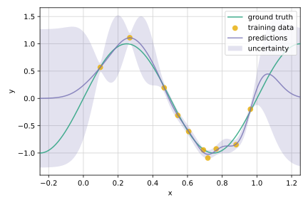

# Gaussian process mini project

This repo just contains some random explorations of Gaussian processes (GPs).
For the moment, the mini project only contains a demonstration of GP regression.
It is planned though to address Bayesian optimization in the future.

A number of illustrative notebooks are provided.
They contain a short introduction to GPs in general and an example of GP regression.
Moreover, the Karhunen-Loève expansion is discussed despite the fact
that this representation applies to a wider class of stochastic processes.

## Notebooks

- [Introduction](notebooks/intro.ipynb)

- [GP regression](notebooks/gp_regression.ipynb)

- [KL expansion](notebooks/kl_expansion.ipynb)

