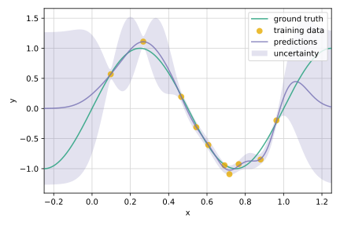

# Gaussian process mini project

This repo just contains some random explorations of Gaussian processes (GPs).
For the moment, the mini project only contains a demonstration of GP regression.
It is planned though to address Bayesian optimization in the future.

## Overview
A short introduction to GPs in general can be found [here](notebooks/intro.ipynb).
[The notebook](notebooks/kl_expansion.ipynb) discusses the Karhunen-Loève expansion,
despite the fact that this representation applies to a wider class of stochastic processes.
An example of GP regression is provided in [another notebook](notebooks/gp_regression.ipynb).

